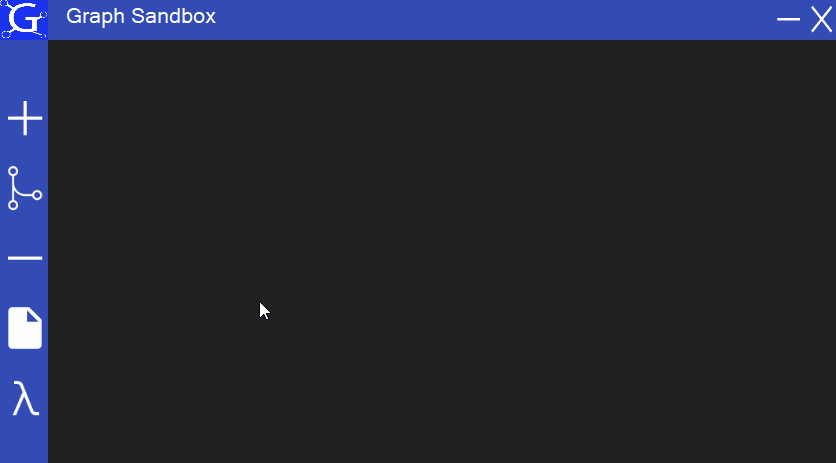
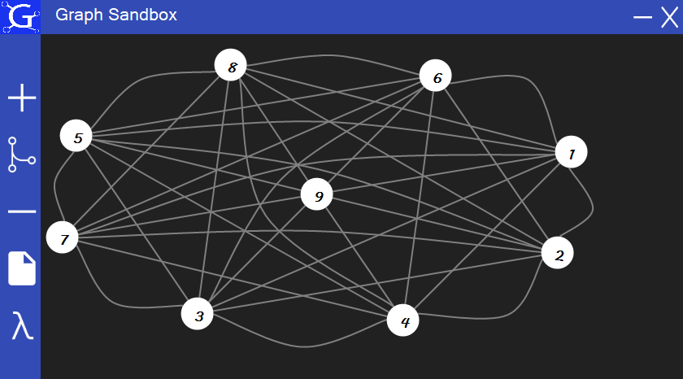
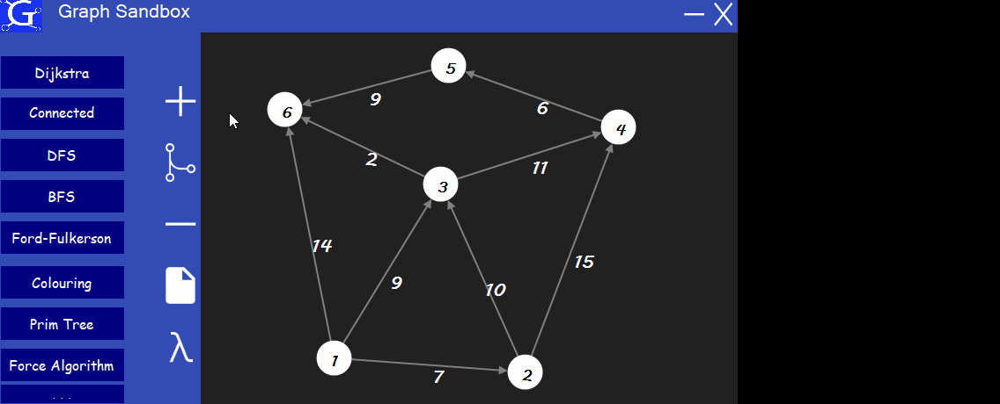
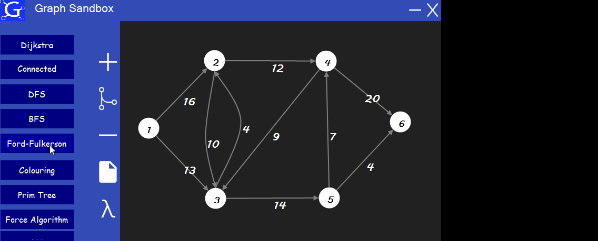

# Graph Sandbox

## What is it
Graph Sandbox is a desktop application written with C# & WinForms. It provides functionality to build graphs of any form via a handy GUI. It's easy to process step-by-step classic graph theory algorithms on it. Furthermore, graphs can be downloaded/uploaded using XML files to save the results of work. If you have searched for application to learn graph theory by example, it's for you!

## Features
* Constructor. Using only a mouse it's easy to create sets of vertices and edges. Also, the application allows to move vertices, bend edges, set edges weight and make it both directed and undirected.
* Algorithms. There are more than 10 graph algorithms implemented including Dijkstra, BFS, DFS, Ford-Fulkerson, Force algorithm, and more. Any of it can be executed step by step with сlear visualization.
* Backupable. Graphs can be both downloaded and uploaded using a comprehensive configuration with XML format.
* Controls. The side dropdown menu provides all of the functionality via intuitive buttons.

## Algorithms
Graph Sandbox provides implementation and visualization of a lot of graph theory algorithms:
* Dijkstra
* Connected components
* DFS
* BFS
* Ford-Fulkerson
* Colouring
* M-Colouring
* Prim
* Kruskal
* Kuhn
* Force algorithm

## XML Format
Use "Download/upload graph" control to save created graph or upload the existing one. XML graph description does not include any information about vertices coordinates on canvas. Therefore, it will be placed on it using Force algorithm. Graph appearance can be changed if needed.

### Example
Application uses GraphML format to deal with it.
```xml
<?xml version='1.0' encoding='utf-8'?>
<graphml xmlns='http://graphml.graphdrawing.org/xmlns'
 xmlns:xsi='http://www.w3.org/2001/XMLSchema-instance' 
 xsi:schemaLocation='http://graphml.graphdrawing.org/x 
 http://graphml.graphdrawing.org/xmlns/1.0/graphml.xsd'>
  <key id='d1' for='edge' attr.name='weight' attr.type='float'/>
  <graph id='G'>
      <node id ='0'/>
      <node id ='1'/>
      <node id ='2'/>
      <edge directed='true' source='0' target='1'>
        <data key='d1'>2,0</data>
      </edge>
      <edge directed='false' source='1' target='2'>
        <data key='d1'>1,0</data>
      </edge>
      <edge directed='true' source='0' target='2'>
        <data key='d1'>5,0</data>
      </edge>
  </graph>
</graphml>
```

## Examples of work
### Main functionality

### Graph example

### Dijkstra algorithm

### Ford-Fulkerson algorithm

